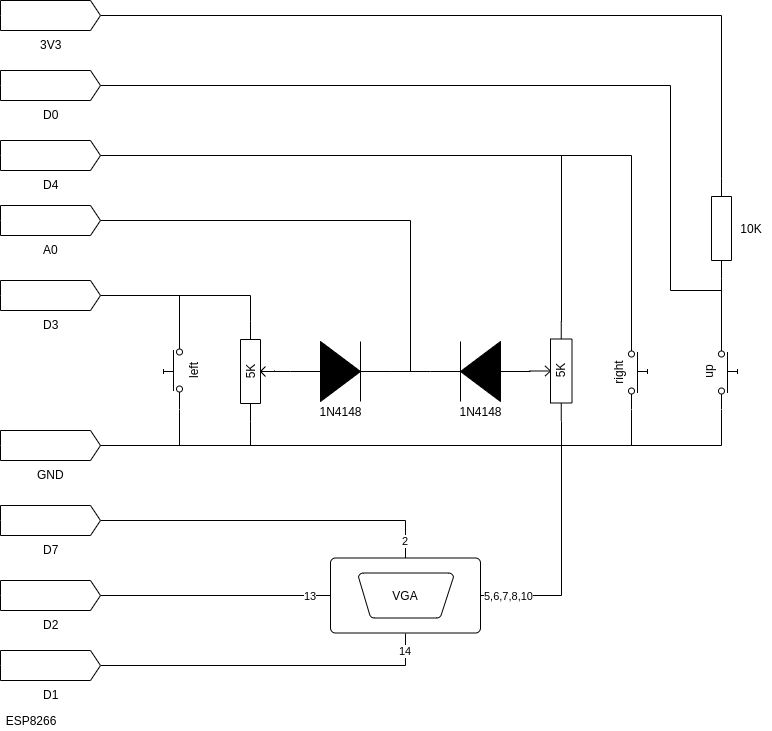

# ESP8266-VGA-Games (TODO: rename to ESP-VGA-Games)
A collection of games running on ESP8266 and (new!) ESP32 with VGA output.

Uses:
ESPVGAX Arduino library targeting ESP8266 only, by Sandro Maffiodo.
https://github.com/smaffer/espvgax

Original 6 games from:
https://github.com/matgoebl/ESP8266-VGA-Games by Roberto Melzi

Pong, Breakout, Snake, Bomber, Etch-a-Sketch and Tetris

ESP32 port by [terryspitz](https://terryspitz.github.io)

Uses:
FabGL ESP32 VGA library by Fabrizio Di Vittorio http://www.fabglib.org/
Including Space Invaders example game.

TODO: merge with Rob Cai's ESP32 Games port: https://www.instructables.com/ESP32-VGA-Arcade-Games-and-Joystick/

# Hardware

